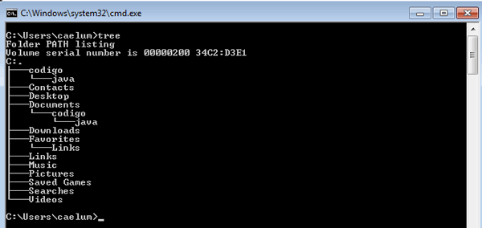

## Tema `cd`
**Guia para Utilizar o Comando `cd` no Prompt de Comando do Windows**

O comando `cd` (change directory) é uma das funcionalidades essenciais do Prompt de Comando do Windows que permite navegar entre pastas e diretórios do sistema operacional. Com este comando, é possível alterar o diretório de trabalho atual para qualquer outro diretório desejado. A seguir, vamos aprender como utilizar o `cd` de forma prática:

1. **Visualizando o Diretório Atual:**
   Para começar, abra o Prompt de Comando do Windows. Ao executá-lo, você será apresentado à localização inicial, geralmente a pasta do usuário. Para visualizar o diretório atual, digite o seguinte comando e pressione "Enter":
   ```
   cd
   ```
   Isso exibirá o caminho completo do diretório atual.

2. **Navegando Entre Diretórios:**
   Para mudar de diretório, você pode usar o comando `cd` seguido do caminho do diretório que deseja acessar. Se o diretório estiver em um caminho absoluto, você pode digitar o caminho completo:
   ```
   cd C:\Exemplo\Pasta
   ```
   Isso o levará diretamente para a pasta "Pasta" localizada no disco C. Se o caminho estiver relativo ao diretório atual, você pode simplesmente digitar o nome da pasta desejada:
   ```
   cd Exemplo
   ```
   Isso o levará para dentro da pasta "Exemplo," assumindo que ela está no diretório atual.

3. **Voltando para o Diretório Anterior:**
   Se você quiser voltar para o diretório anterior, pode utilizar o comando `cd ..`:
   ```
   cd ..
   ```
   Esse comando o levará uma pasta acima na hierarquia de diretórios.

4. **Voltando para o Diretório Raiz:**
   Para retornar ao diretório raiz do sistema, basta digitar o seguinte comando:
   ```
   cd \
   ```
   Isso o levará diretamente para o diretório raiz do disco atual.

5. **Navegando Entre Unidades de Disco:**
   No Windows, você pode ter várias unidades de disco (por exemplo, C:, D:, E:, etc.). Para navegar entre elas no Prompt de Comando, basta digitar a letra da unidade seguida de dois-pontos:
   ```
   D:
   ```
   Isso o levará para o diretório raiz da unidade D.

6. **Diretórios com Espaços e Caracteres Especiais:**
   Se o nome de algum diretório contiver espaços ou caracteres especiais, é necessário colocar o caminho entre aspas duplas:
   ```
   cd "C:\Meus Documentos"
   ```

7. **Autocompletar de Nomes de Diretórios:**
   Para facilitar a navegação, o Prompt de Comando possui uma funcionalidade de autocompletar nomes de diretórios. Basta digitar as primeiras letras do nome do diretório e pressionar a tecla "Tab" para que o sistema complemente o restante do nome automaticamente.

8. **Listando o Conteúdo de um Diretório:**
   Para visualizar o conteúdo de um diretório sem alterar o diretório atual, você pode usar o comando `dir`. Isso mostrará os arquivos e pastas presentes no diretório atual.

9. **Exemplos Práticos:**
   - Navegar para a pasta "Documentos":
     ```
     cd C:\Users\SeuUsuario\Documents
     ```
   - Voltar uma pasta acima:
     ```
     cd ..
     ```
   - Navegar para a unidade D:
     ```
     D:
     ```
   - Navegar para a pasta "Program Files":
     ```
     cd "C:\Program Files"
     ```

O comando `cd` é uma ferramenta poderosa para a navegação eficiente entre diretórios no Prompt de Comando do Windows. Com este guia, você está pronto para explorar e trabalhar com facilidade nos diretórios do sistema. Lembre-se de praticar e experimentar com os comandos para se tornar mais confiante no uso do `cd`.

## Tema 2
Quando estamos trabalhando com o prompt de comando temos à disposição diversos comandos. Um dos mais interessantes é o comando tree, que nos mostra a estrutura de pastas do sistema.

Vamos fazer mais um teste! No prompt, digite o comando tree:





Dependendo do diretório atual, muitas informações podem aparecer; mas, repare que o comando tree mostra as pastas e subpastas organizadas em uma árvore.

O tree pode ser útil para entender a estrutura de um projeto. Com esse comando, você já pode ver facilmente como o projeto está organizado! É um recurso muito útil!

## Tema 3

O comando ``more`` funciona de forma semelhante ao comando ``type``, com a diferença de exibir página por página do arquivo no terminal, em vez de mostrá-lo todo de uma vez.

Para utilizar o comando, utilizamos o ``more`` seguido do nome do arquivo que se deseja exibir o conteúdo. Por exemplo: ``more arquivo.txt``.

Esse comando é muito útil quando queremos exibir arquivos de texto com várias linhas para ler lentamente, em vez de abri-lo todo no terminal de uma única vez.

Um exemplo disso é quando queremos ler os logs de uma aplicação que está em um servidor na nuvem; neste caso, é preciso ler grandes arquivos de texto linha a linha para identificar um bug ou realizar algum teste.

## Tema 4

Alguns dos principais comandos usados no dia a dia, porém, o cmd oferece diversos outros comandos, como:

``fc``: File Compare ou “Comparação de Arquivos” (em português); compara dois arquivos ou grupos de arquivos e mostra as diferenças entre eles. Caso não haja diferença, uma mensagem é exibida informando que nenhuma diferença foi encontrada. Por exemplo:
```
C:\Users\Emerson\Desktop>type a.txt
texto a

C:\Users\Emerson\Desktop>type b.txt
texto b

C:\Users\Emerson\Desktop>fc a.txt b.txt
Comparando os arquivos a.txt e B.TXT
***** a.txt
texto a
***** B.TXT
texto b
*****

C:\Users\Emerson\Desktop>fc a.txt a.txt
Comparando os arquivos a.txt e A.TXT
FC: nenhuma diferença encontrada
```


``systeminfo``: como o nome do comando sugere, ele traz informações em detalhes sobre o seu Windows.

``rmdir``: vimos o mkdir para criar um diretório, mas caso queiramos excluí-lo, usamos o rmdir (remove directory ou, em português, remover diretório).

``shutdown``: permite desligar ou reiniciar o computador de forma imediata ou agendada.

``date``: exibe a data atual e permite alterá-la. Por exemplo:

```
C:\Users\Emerson\Desktop>date
Data atual: 04/01/2023
Digite a nova data: (dd-mm-aa)  _
```

``find``: busca uma sequência de texto em um arquivo ou arquivos. Por exemplo:
```
C:\Users\Emerson\Desktop>type exemplo.txt
Estou muito feliz, pois estou aprendendo mais sobre o prompt de comando

C:\Users\Emerson\Desktop>find “triste” exemplo.txt
- - - - - - - - - -  EXEMPLO.TXT

C:\Users\Emerson\Desktop>find “feliz” exemplo.txt
- - - - - - - - - -  EXEMPLO.TXT
    Estou muito feliz, pois estou aprendendo mais sobre o prompt de comando
```
    
``exit``: fecha o cmd.

## Tema 5

Por que usar um terminal?
Conhecer o terminal de comandos é um recurso interessante, pois muitas ferramentas no setor de desenvolvimento não possuem uma interface gráfica.

### Abrir o prompt de comando
O primeiro passo é abrir um terminal (ou console). No mundo Windows, esse terminal se chama Prompt de comando ou, abreviando, cmd. Para abrir um novo terminal, devemos ir em Todos os Programas (ícone do Windows que normalmente fica no canto inferior esquerdo), digitarmos ``cmd`` e apertarmos Enter. Outra forma de abrir o Prompt é pelo atalho Botão Iniciar + R e no campo de pesquisa digitar ``cmd``.

### Listando arquivos
Para listar todos os arquivos em diretórios, usamos o comando ``dir`` e então recebemos uma lista dos arquivos e pastas existentes.

### Navegando entre diretórios
Para mudarmos de pasta, utilizamos o comando ``cd`` (change directory) seguido do nome da subpasta. Por exemplo: ``cd Documents`` . Para voltarmos ao diretório anterior, usamos o comando ``cd ...`` 

### Criando diretórios
Para criarmos diretórios, usamos o comando ``mkdir`` (make directory). Lembre-se de evitar acentos e espaços nos nomes de arquivos e diretórios. Uma boa boa prática é usar o caractere ``_`` ao invés do espaço ao criar diretórios.

### Trabalhando com arquivos
Para mover arquivos ou pastas, utilizamos o comando ``move`` e indicamos o arquivo com o nome completo (incluindo o caminho dos diretórios). Por exemplo: ``move ..\Desktop\texto.txt`` . Já para conferir o conteúdo de um arquivo, usamos o comando ``type``, como em ``type texto.txt``.

Para a função de copiar um arquivo, utilizamos o comando ``copy``, como em ``copy texto.txt texto2.txt``. Já para renomear um arquivo, utilizamos o comando ``rename`` seguido do nome original do arquivo e o nome que desejamos aplicar, como em ``rename texto2.txt mensagem.txt``. E, por fim, para apagar um arquivo, utilizamos o comando ``del`` seguido do nome do arquivo que se deseja deletar, por exemplo, ``del texto.txt``.

### Limpando o terminal
Com o tempo, o terminal vai ficar poluído com comandos antigos, que tiram o foco e dificultam a legibilidade. Para limpar o terminal, utilizamos ``cls`` (clear screen).

## Tema 6

Comando tar: compactando arquivos
Esse comando possui duas flags, ou parâmetros:

-``C``: indica que a ação que realizaremos naquele momento é a compactação de arquivos;

-``F``: para nomear o arquivo compactado ao final.

Vamos digitar esse comando no nosso terminal e, para indicar que queremos inserir algumas informações especiais, usamos a flag. Com ela, conseguimos utilizar várias funcionalidades com o mesmo comando.

Por exemplo, queremos usar o comando tar para compactar. Mas, com esse mesmo comando, podemos mudar as flags para tanto descompactar como listar o conteúdo de um arquivo compactado.

Para compactar, digitamos um hífen (``-``) indicando que queremos inserir uma flag para esse comando, junto da letra ``c``, flag de compactação. Damos um espaço e digitamos mais um hífen com a flag ``f``, de nomeação: tar ``-c`` ``-f``

Podemos construir o comando desse jeito ou unificar as flags, digitando o hífen apenas uma vez e inserindo as flags em sequência: tar ``-cf``.

O próximo parâmetro que esse comando exige é o nome do arquivo compactado. Vamos nomeá-lo como "notas" junto da extensão ``.zip``, usada para compactar arquivos.

Por fim, passamos o que, afinal, queremos compactar. No caso, são os nossos dois arquivos XML: ``NF001.xml`` e ``NF002.xml``.

Nosso comando ficou assim:

```
Desktop>tar -cf notas.zip NF001.xml NF002.xml
```
Agora, podemos apertar "Enter" para executá-lo. Não teremos nenhuma resposta do terminal; mas, se digitarmos o comando dir para verificar o conteúdo do Desktop, encontraremos:

```
Pasta de C:\Users\Emerson\Desktop

26/12/2022 10:13 83 NF001.xml
26/12/2022 10:13 83 NF002.xml
26/12/2022 15:43 3.072 notas.zip
3 arquivo(s) 3.238 bytes
```

Ou seja, o nosso arquivo compactado ``notas.zip`` foi criado.

## Tema 7

Durante o vídeo Tratando erros, criamos o seguinte script:

```
@echo off
echo `Compactando arquivos`
tar -cf notas.zip *.xml  2>erros.txt

IF %ERRORLEVEL% NEQ 0 (echo "Erro na execução do script.")
```

Agora vamos entender em detalhes cada uma das linhas desse script:

```
@echo off
```

Com esse comando desabilitamos a exibição dos comandos no prompt do Windows relacionados ao conteúdo das instruções contidas no arquivo.

Vamos usar como exemplo o script ``exemplo.bat``, com o conteúdo ``echo Olá Mundo!``. Ao executarmos esse simples script, teremos como retorno o seguinte:

```
c:\Users\Emerson\Desktop>.\exemplo.bat

c:\Users\Emerson\Desktop>echo Olá Mundo
Olá Mundo

c:\Users\Emerson\Desktop>
```

Ao adicionarmos o ``@echo off``, teremos como resultado:

```
c:\Users\Emerson\Desktop>.\exemplo.bat
Olá Mundo

c:\Users\Emerson\Desktop>
```

Perceba que não é exibido qual é o comando dentro do arquivo, apenas o seu resultado.

```
echo `Compactando arquivos`
```

Com este comando, exibimos uma mensagem para o usuário sobre a compactação.

```
tar -cf notas.zip *.xml  2>erros.txt`
```

Para lidar com arquivos compactados, usamos o comando ``tar``. Podemos ver mais detalhes com o comando ``tar /?``, que retorna as seguintes informações:

```
C:\Users\Emerson\Desktop>tar /? 

Usage:

List: tar -tf <archive-filename>
Extract: tar -xf <archive-filename>
Create: tar -cf <archive-filename> [filenames…]
Help: tar --help
```

Visto que queremos compactar um arquivo, usamos as flags ``cf``.

O próximo argumento, o ``notas.zip``, é o nome do arquivo quando for compactado, seguido do que eu quero compactar, no caso, ``*.xml``. Com isso, estamos falando que todos os arquivos que terminam com a extensão ``.xml`` serão compactados.

Finalizando o comando, temos ``2>erros.txt``, que nos diz que estamos redirecionando a saída do comando (ou seja, pegando o resultado gerado pelo ``tar`` e levando para algum lugar).
```
IF %ERRORLEVEL% NEQ 0 (echo "Erro na execução do script.")
```

E, por fim, fazemos uma condição representada pelo ``IF``, indicando que se o conteúdo da variável ``ERRORLEVEL`` não for igual (``NEQ``, ou seja, Not EQual to) a zero, nós exibimos uma mensagem à pessoa informando que não foi possível encontrar os arquivos.

Quase todos os aplicativos e utilitários definirão um código de saída representado pela variável ``ERRORLEVEL``. Quando seu valor é zero, indica que houve sucesso na execução. Como estamos avaliando o caso de ser diferente de zero, estamos tratando justamente quando houver algum erro.

## Tema 8

Quando trabalhamos com scripts, é comum precisarmos armazenar temporariamente informações em nosso computador. Para isso, utilizamos variáveis, que permitem colocar dados em um espaço de memória e, posteriormente, sobrepor com outras informações. Essa prática é comum tanto em nossos próprios scripts quanto em programas externos, como Java e Python.

Vamos aprender como trabalhar com variáveis de forma prática. Primeiro, criaremos um script para armazenar duas variáveis: uma chamada "nome" e outra chamada "email". Em seguida, exibiremos uma mensagem contendo essas duas variáveis para o usuário final.

No Windows Prompt, podemos criar uma variável digitando "set" seguido pelo nome da variável e o valor que desejamos atribuir a ela. Por exemplo, para criar a variável "mensagem" com o valor "Olá Mundo!", digitamos:

```
set mensagem=Olá Mundo!
```

Para exibir o conteúdo de uma variável, utilizamos o comando "echo" e colocamos a variável entre porcentagens, assim: `echo %mensagem%`.

Agora, vamos criar um script que permita o cadastro do nome e email no Prompt. Primeiro, abrimos o bloco de notas digitando "notepad" no terminal. Em seguida, escrevemos o código do script:

```
@echo off
cls
set /p nome=Digite seu nome completo: 
set /p email=Digite seu e-mail principal: 
echo Seu nome é %nome% e seu e-mail %email%
```

Explicando o script, a primeira linha `@echo off` serve para não exibir os comandos, mostrando apenas o resultado no terminal.

Usamos `cls` para limpar o terminal.

Com `set /p`, permitimos que o usuário digite o nome e o email, e essas informações são armazenadas nas variáveis "nome" e "email", respectivamente.

Ao utilizar `echo` para exibir a mensagem, inserimos as variáveis entre porcentagens para mostrar o conteúdo.

Salvamos o arquivo como "script.bat" e o executamos digitando `.\script.bat` no terminal.

Depois de preenchermos os campos nome e email, o script exibirá a mensagem com as informações digitadas.

Para editar o script e remover a mensagem do "pause", abrimos o arquivo "script.bat" no bloco de notas e removemos a linha `echo Pressione [enter] para continuar`. Salvamos e fechamos o arquivo.

Reexecutamos o script e obtemos o mesmo resultado, mas sem a mensagem redundante.

É importante lembrar que as variáveis criadas são temporárias e existem apenas no terminal em que foram criadas. Se fecharmos o terminal, as variáveis não estarão mais disponíveis.

Por fim, reforçamos que as variáveis são uma ferramenta poderosa para manipular dados em nossos scripts, tornando-os mais dinâmicos e interativos.