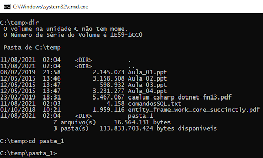

## Tema `cd`
**Guia para Utilizar o Comando `cd` no Prompt de Comando do Windows**

O comando `cd` (change directory) é uma das funcionalidades essenciais do Prompt de Comando do Windows que permite navegar entre pastas e diretórios do sistema operacional. Com este comando, é possível alterar o diretório de trabalho atual para qualquer outro diretório desejado. A seguir, vamos aprender como utilizar o `cd` de forma prática:

1. **Visualizando o Diretório Atual:**
   Para começar, abra o Prompt de Comando do Windows. Ao executá-lo, você será apresentado à localização inicial, geralmente a pasta do usuário. Para visualizar o diretório atual, digite o seguinte comando e pressione "Enter":
   ```
   cd
   ```
   Isso exibirá o caminho completo do diretório atual.

2. **Navegando Entre Diretórios:**
   Para mudar de diretório, você pode usar o comando `cd` seguido do caminho do diretório que deseja acessar. Se o diretório estiver em um caminho absoluto, você pode digitar o caminho completo:
   ```
   cd C:\Exemplo\Pasta
   ```
   Isso o levará diretamente para a pasta "Pasta" localizada no disco C. Se o caminho estiver relativo ao diretório atual, você pode simplesmente digitar o nome da pasta desejada:
   ```
   cd Exemplo
   ```
   Isso o levará para dentro da pasta "Exemplo," assumindo que ela está no diretório atual.

3. **Voltando para o Diretório Anterior:**
   Se você quiser voltar para o diretório anterior, pode utilizar o comando `cd ..`:
   ```
   cd ..
   ```
   Esse comando o levará uma pasta acima na hierarquia de diretórios.

4. **Voltando para o Diretório Raiz:**
   Para retornar ao diretório raiz do sistema, basta digitar o seguinte comando:
   ```
   cd \
   ```
   Isso o levará diretamente para o diretório raiz do disco atual.

5. **Navegando Entre Unidades de Disco:**
   No Windows, você pode ter várias unidades de disco (por exemplo, C:, D:, E:, etc.). Para navegar entre elas no Prompt de Comando, basta digitar a letra da unidade seguida de dois-pontos:
   ```
   D:
   ```
   Isso o levará para o diretório raiz da unidade D.

6. **Diretórios com Espaços e Caracteres Especiais:**
   Se o nome de algum diretório contiver espaços ou caracteres especiais, é necessário colocar o caminho entre aspas duplas:
   ```
   cd "C:\Meus Documentos"
   ```

7. **Autocompletar de Nomes de Diretórios:**
   Para facilitar a navegação, o Prompt de Comando possui uma funcionalidade de autocompletar nomes de diretórios. Basta digitar as primeiras letras do nome do diretório e pressionar a tecla "Tab" para que o sistema complemente o restante do nome automaticamente.

8. **Listando o Conteúdo de um Diretório:**
   Para visualizar o conteúdo de um diretório sem alterar o diretório atual, você pode usar o comando `dir`. Isso mostrará os arquivos e pastas presentes no diretório atual.

9. **Exemplos Práticos:**
   - Navegar para a pasta "Documentos":
     ```
     cd C:\Users\SeuUsuario\Documents
     ```
   - Voltar uma pasta acima:
     ```
     cd ..
     ```
   - Navegar para a unidade D:
     ```
     D:
     ```
   - Navegar para a pasta "Program Files":
     ```
     cd "C:\Program Files"
     ```

O comando `cd` é uma ferramenta poderosa para a navegação eficiente entre diretórios no Prompt de Comando do Windows. Com este guia, você está pronto para explorar e trabalhar com facilidade nos diretórios do sistema. Lembre-se de praticar e experimentar com os comandos para se tornar mais confiante no uso do `cd`.

## Tema `Dir`

**Guia para Utilizar o Comando `dir` no Prompt de Comando do Windows**

O comando `dir` é uma ferramenta essencial do Prompt de Comando do Windows que permite listar o conteúdo de um diretório específico. Com este comando, você pode visualizar os arquivos e pastas presentes em um diretório, bem como suas propriedades e informações relevantes. A seguir, vamos aprender como utilizar o `dir` de forma prática:

1. **Listando o Conteúdo do Diretório Atual:**
   Para visualizar o conteúdo do diretório atual, basta abrir o Prompt de Comando e digitar o seguinte comando:
   ```
   dir
   ```
   Ao pressionar "Enter", o Prompt de Comando mostrará uma lista detalhada de todos os arquivos e pastas presentes no diretório em que você está posicionado.

2. **Listando o Conteúdo de um Diretório Específico:**
   Para listar o conteúdo de um diretório específico, você precisa fornecer o caminho absoluto ou relativo do diretório após o comando `dir`. Por exemplo:
   ```
   dir C:\Exemplo\Pasta
   ```
   Esse comando exibirá a lista de arquivos e pastas dentro do diretório "Pasta" localizado no caminho C:\Exemplo.

3. **Opções para Exibir Detalhes:**
   O comando `dir` pode ser usado com diversas opções para exibir informações adicionais sobre os arquivos e pastas listados. Algumas opções úteis são:
   - `/W`: Exibe a lista em formato de colunas.
   - `/P`: Exibe a lista por páginas, pausando após cada tela cheia.
   - `/A`: Exibe arquivos e pastas ocultos.
   - `/S`: Lista o conteúdo de forma recursiva, mostrando também o conteúdo de subpastas.

4. **Filtrando a Listagem:**
   Você pode filtrar a listagem de arquivos usando caracteres curinga, como `*` e `?`, para corresponder a nomes de arquivo específicos. Por exemplo:
   ```
   dir *.txt
   ```
   Isso exibirá apenas os arquivos com extensão ".txt" no diretório atual.

5. **Redirecionando a Saída:**
   Assim como outros comandos, você pode redirecionar a saída do comando `dir` para um arquivo de texto, em vez de exibi-la no prompt. Basta usar o operador de redirecionamento `>` seguido do nome do arquivo. Por exemplo:
   ```
   dir > lista.txt
   ```
   Esse comando criará um arquivo chamado "lista.txt" contendo a lista de arquivos e pastas do diretório atual.

6. **Ordenando a Listagem:**
   Se você deseja ordenar a lista de arquivos, pode usar a opção `/O`. Por exemplo, para listar os arquivos por tamanho, use:
   ```
   dir /O:S
   ```
   Isso classificará os arquivos por tamanho, mostrando os maiores primeiro.

7. **Exemplos Práticos:**
   - Listar o conteúdo do diretório atual:
     ```
     dir
     ```
   - Listar o conteúdo do diretório "Downloads":
     ```
     dir C:\Users\SeuUsuario\Downloads
     ```
   - Listar arquivos com extensão ".docx" no diretório atual:
     ```
     dir *.docx
     ```
   - Listar conteúdo de forma recursiva, incluindo subpastas:
     ```
     dir /S
     ```
   - Redirecionar a listagem para um arquivo de texto:
     ```
     dir > lista_de_arquivos.txt
     ```

O comando `dir` é uma ferramenta poderosa para visualizar e gerenciar o conteúdo de diretórios no Prompt de Comando do Windows. Experimente as opções disponíveis e torne-se mais eficiente em sua navegação e organização de arquivos e pastas. Pratique regularmente e explore todas as funcionalidades que o `dir` tem a oferecer!



## Tema `More`

**Guia para Utilizar o Comando `more` no Prompt de Comando do Windows**

O comando `more` é uma ferramenta útil do Prompt de Comando do Windows que permite visualizar o conteúdo de arquivos de texto de forma paginada. Ele é especialmente útil quando você deseja ler arquivos extensos linha por linha, evitando que o conteúdo se sobreponha rapidamente no prompt. A seguir, vamos aprender como utilizar o `more` de forma prática:

1. **Exibindo o Conteúdo Completo de um Arquivo de Texto:**
   Para visualizar o conteúdo completo de um arquivo de texto no Prompt de Comando, basta digitar o seguinte comando, seguido do nome do arquivo:
   ```
   more nome_do_arquivo.txt
   ```
   Ao pressionar "Enter", o Prompt de Comando exibirá o conteúdo completo do arquivo. Você pode navegar pelas linhas usando as teclas "Seta para Baixo" ou "Barra de Espaço".

2. **Visualizando o Conteúdo de Forma Paginada:**
   Por padrão, o `more` exibe o conteúdo do arquivo de forma paginada, mostrando uma tela de cada vez. Quando o final da primeira tela é atingido, você pode pressionar a tecla "Barra de Espaço" para avançar uma tela, ou a tecla "Enter" para avançar uma linha por vez.

3. **Navegando Pelo Conteúdo:**
   Além das teclas mencionadas acima, você pode usar as teclas "Seta para Cima" para voltar uma linha, e "Q" para sair do modo de visualização e retornar ao prompt do comando.

4. **Utilizando o Redirecionamento de Saída:**
   O comando `more` também pode ser usado em conjunto com o redirecionamento de saída para exibir o conteúdo de um arquivo paginado em um novo arquivo de texto. Por exemplo:
   ```
   more nome_do_arquivo.txt > arquivo_paginado.txt
   ```
   Esse comando criará um novo arquivo chamado "arquivo_paginado.txt" contendo o conteúdo do arquivo original exibido de forma paginada.

5. **Exemplos Práticos:**
   - Visualizar o conteúdo completo de um arquivo:
     ```
     more texto.txt
     ```
   - Visualizar o conteúdo de um arquivo paginado:
     ```
     more longo_texto.txt
     ```
   - Navegar pelo conteúdo paginado:
     ```
     more arquivo.txt
     ```
     (Pressione "Barra de Espaço" para avançar, "Seta para Cima" para voltar, "Q" para sair)
   - Redirecionar a saída paginada para um novo arquivo:
     ```
     more conteudo.txt > paginado.txt
     ```

O comando `more` é uma ferramenta útil para visualizar o conteúdo de arquivos de texto no Prompt de Comando do Windows. Com ele, você pode ler arquivos extensos de forma mais confortável e controlada, além de utilizar opções de redirecionamento de saída para criar novos arquivos com o conteúdo paginado. Experimente e aproveite essa funcionalidade para facilitar a leitura de arquivos em linha de comando!

## Tema `Tree`
**Guia para Utilizar o Comando `tree` no Prompt de Comando do Windows**

O comando `tree` é uma funcionalidade útil do Prompt de Comando do Windows que permite visualizar a estrutura hierárquica de pastas e subpastas em um diretório específico. Ele cria uma representação gráfica em forma de árvore, facilitando a compreensão da organização dos arquivos e diretórios em uma determinada pasta. A seguir, vamos aprender como utilizar o `tree` de forma prática:

1. **Visualizando a Estrutura de Diretórios do Diretório Atual:**
   Para visualizar a estrutura de diretórios do diretório atual, abra o Prompt de Comando e digite o seguinte comando:
   ```
   tree
   ```
   Ao pressionar "Enter", o Prompt de Comando mostrará uma representação gráfica da estrutura de pastas e subpastas a partir do diretório em que você está posicionado.

2. **Visualizando a Estrutura de Diretórios de um Diretório Específico:**
   Você também pode utilizar o comando `tree` para visualizar a estrutura de um diretório específico. Basta fornecer o caminho absoluto ou relativo do diretório após o comando `tree`. Por exemplo:
   ```
   tree C:\Exemplo\Pasta
   ```
   Esse comando exibirá a representação gráfica da estrutura de pastas e subpastas a partir do diretório "Pasta" localizado no caminho C:\Exemplo.

3. **Limitando a Profundidade da Visualização:**
   Por padrão, o `tree` exibe a estrutura de pastas e subpastas completa, até o nível mais profundo. No entanto, você pode limitar a profundidade da visualização utilizando a opção `/A` seguida do número de níveis desejados. Por exemplo:
   ```
   tree /A 2
   ```
   Esse comando exibirá a estrutura de diretórios até o segundo nível de profundidade.

4. **Excluindo Arquivos da Visualização:**
   O `tree` também permite excluir os arquivos da visualização, exibindo apenas a estrutura de diretórios. Para isso, utilize a opção `/F`:
   ```
   tree /F
   ```
   Isso mostrará apenas as pastas presentes na estrutura hierárquica.

5. **Copiando a Saída para a Área de Transferência:**
   Caso deseje copiar a saída do `tree` para a área de transferência, você pode redirecionar a saída para o comando `clip` usando o operador de redirecionamento `|`. Por exemplo:
   ```
   tree | clip
   ```
   Isso copiará a representação gráfica da estrutura de diretórios para a área de transferência, permitindo colá-la em outro aplicativo, como um editor de texto ou planilha.

6. **Exemplos Práticos:**
   - Visualizar a estrutura de diretórios do diretório atual:
     ```
     tree
     ```
   - Visualizar a estrutura de diretórios de um diretório específico:
     ```
     tree C:\Exemplo\Pasta
     ```
   - Limitar a visualização a dois níveis de profundidade:
     ```
     tree /A 2
     ```
   - Excluir arquivos da visualização:
     ```
     tree /F
     ```
   - Copiar a saída para a área de transferência:
     ```
     tree | clip
     ```

O comando `tree` é uma ferramenta valiosa para visualizar e compreender a organização de pastas e subpastas em um diretório. Ao utilizar suas opções, você pode adaptar a visualização de acordo com suas necessidades e tornar a navegação e a análise da estrutura de diretórios mais eficientes. Pratique com diferentes diretórios e explore todas as possibilidades que o `tree` tem a oferecer!


## Tema `fc`

**Guia para Utilizar o Comando `fc` no Prompt de Comando do Windows**

O comando `fc` (File Compare) é uma ferramenta do Prompt de Comando do Windows que permite comparar o conteúdo de dois arquivos de texto e exibir as diferenças entre eles. Ele é especialmente útil para verificar se dois arquivos são idênticos ou para identificar alterações específicas entre eles. A seguir, vamos aprender como utilizar o `fc` de forma prática:

1. **Comparando Dois Arquivos:**
   Para comparar dois arquivos de texto, digite o seguinte comando no Prompt de Comando:
   ```
   fc nome_do_arquivo1.txt nome_do_arquivo2.txt
   ```
   O Prompt de Comando exibirá as diferenças encontradas entre os dois arquivos, se houver. Caso não haja nenhuma diferença, uma mensagem informando que "nenhuma diferença foi encontrada" será exibida.

2. **Formato da Saída:**
   Por padrão, o `fc` exibe as diferenças entre os arquivos usando o seguinte formato:
   ```
   ***** nome_do_arquivo1.txt
   linha1
   linha2
   ...
   linhaN
   ***** nome_do_arquivo2.txt
   linha1
   linha2
   ...
   linhaN
   *****
   ```
   As linhas que são idênticas nos dois arquivos não são exibidas na saída. Apenas as linhas diferentes são apresentadas para facilitar a análise.

3. **Comparando Diferentes Formatos de Linha:**
   Se os arquivos comparados tiverem formatos de linha diferentes (por exemplo, um arquivo com quebra de linha Unix e outro com quebra de linha Windows), o `fc` pode retornar uma mensagem de erro indicando que os arquivos não são comparáveis diretamente. Nesse caso, você pode usar a opção `/B` para realizar uma comparação binária, ignorando as diferenças de formato de linha:
   ```
   fc /B nome_do_arquivo1.txt nome_do_arquivo2.txt
   ```

4. **Comparando Caracteres Especiais e Espaços em Branco:**
   Por padrão, o `fc` realiza uma comparação entre os arquivos sem levar em conta caracteres especiais e espaços em branco no início e no final das linhas. Caso deseje realizar uma comparação sensível a essas diferenças, você pode usar a opção `/W`:
   ```
   fc /W nome_do_arquivo1.txt nome_do_arquivo2.txt
   ```

5. **Redirecionamento de Saída:**
   Assim como em outros comandos do Prompt de Comando, você pode redirecionar a saída do `fc` para um arquivo de texto. Por exemplo, para salvar a saída da comparação em um arquivo chamado "diferencas.txt", você pode usar o seguinte comando:
   ```
   fc arquivo1.txt arquivo2.txt > diferencas.txt
   ```

6. **Exemplos Práticos:**
   - Comparar dois arquivos:
     ```
     fc arquivo1.txt arquivo2.txt
     ```
   - Comparar dois arquivos com formato de linha diferente:
     ```
     fc /B arquivo1.txt arquivo2.txt
     ```
   - Comparar dois arquivos sensíveis a caracteres especiais e espaços em branco:
     ```
     fc /W arquivo1.txt arquivo2.txt
     ```
   - Comparar e redirecionar a saída para um arquivo:
     ```
     fc arquivo1.txt arquivo2.txt > resultado.txt
     ```

O comando `fc` é uma ferramenta útil para comparar o conteúdo de dois arquivos de texto e identificar diferenças entre eles. Utilize as opções disponíveis conforme a necessidade do seu trabalho e aproveite essa funcionalidade para analisar e verificar a integridade dos arquivos no Prompt de Comando do Windows!

## Tema `sisteminfo`

**Guia para Utilizar o Comando `systeminfo` no Prompt de Comando do Windows**

O comando `systeminfo` é uma ferramenta do Prompt de Comando do Windows que permite visualizar informações detalhadas sobre o sistema operacional e o hardware do computador. Ele fornece uma visão geral das configurações do sistema, incluindo informações sobre a versão do Windows, a quantidade de memória RAM, os adaptadores de rede, os discos rígidos, entre outros detalhes importantes. A seguir, vamos aprender como utilizar o `systeminfo` de forma prática:

1. **Exibindo Informações Gerais do Sistema:**
   Para visualizar as informações gerais do sistema, digite o seguinte comando no Prompt de Comando:
   ```
   systeminfo
   ```
   Ao pressionar "Enter", o Prompt de Comando exibirá uma lista detalhada com várias informações sobre o sistema operacional e o hardware.

2. **Filtrando as Informações:**
   A saída do comando `systeminfo` pode ser extensa, especialmente em computadores com muitos componentes e atualizações. Para tornar a visualização mais fácil, você pode utilizar o redirecionamento de saída e o comando `find` para filtrar as informações por palavra-chave específica. Por exemplo, para exibir apenas informações sobre a placa de rede, você pode usar o seguinte comando:
   ```
   systeminfo | find "Adaptador"
   ```

3. **Exportando as Informações para um Arquivo de Texto:**
   Para salvar as informações exibidas pelo `systeminfo` em um arquivo de texto, você pode utilizar o redirecionamento de saída para criar um novo arquivo. Por exemplo:
   ```
   systeminfo > informacoes_do_sistema.txt
   ```
   Isso criará um arquivo chamado "informacoes_do_sistema.txt" contendo todas as informações exibidas pelo comando.

4. **Obtendo Informações Específicas:**
   O `systeminfo` oferece uma variedade de informações detalhadas sobre o sistema, como nome do host, versão do sistema operacional, data de instalação, hotfixes instalados, memória física, entre outros. Para visualizar informações específicas, você pode usar a opção `/fo` para formatar a saída em um estilo específico, como `TABLE` (tabela), `LIST` (lista) ou `CSV` (valores separados por vírgula). Por exemplo:
   ```
   systeminfo /fo table
   ```

5. **Exemplos Práticos:**
   - Exibir todas as informações do sistema:
     ```
     systeminfo
     ```
   - Filtrar informações sobre a placa de rede:
     ```
     systeminfo | find "Adaptador"
     ```
   - Exportar todas as informações para um arquivo de texto:
     ```
     systeminfo > informacoes_do_sistema.txt
     ```
   - Exibir informações em formato de tabela:
     ```
     systeminfo /fo table
     ```

O comando `systeminfo` é uma ferramenta poderosa para obter informações detalhadas sobre o sistema operacional e o hardware do seu computador diretamente no Prompt de Comando do Windows. Utilize as opções disponíveis para filtrar e exportar as informações conforme suas necessidades de análise e diagnóstico. Aproveite essa funcionalidade para conhecer melhor o seu sistema e solucionar problemas de forma mais eficiente!

## Tema `rmdir`

**Guia para Utilizar o Comando `rmdir` no Prompt de Comando do Windows**

O comando `rmdir` (remove directory) é uma ferramenta do Prompt de Comando do Windows que permite remover diretórios (pastas) vazios do sistema de arquivos. Ele é útil quando você deseja excluir pastas que não contêm nenhum arquivo ou subpasta. A seguir, vamos aprender como utilizar o `rmdir` de forma prática:

1. **Sintaxe Básica:**
   Para utilizar o comando `rmdir`, digite o seguinte comando no Prompt de Comando:
   ```
   rmdir nome_do_diretorio
   ```
   Substitua "nome_do_diretorio" pelo nome da pasta que deseja remover. É importante destacar que o diretório precisa estar vazio para que o comando funcione.

2. **Remoção Recursiva:**
   Caso queira remover um diretório que contenha arquivos ou subpastas, é necessário utilizar a opção `/s` (subdirs) para uma remoção recursiva. Isso permite que o `rmdir` exclua todos os arquivos e subdiretórios presentes no diretório especificado antes de removê-lo. A opção `/q` (quiet) pode ser usada para executar a exclusão sem a exibição de mensagens de confirmação:
   ```
   rmdir /s /q nome_do_diretorio
   ```

3. **Remoção de Diretórios com Espaços no Nome:**
   Caso o nome do diretório contenha espaços, é necessário envolver o nome entre aspas para que o comando seja executado corretamente:
   ```
   rmdir /s /q "nome do diretorio"
   ```

4. **Exemplo Prático:**
   - Para remover um diretório vazio:
     ```
     rmdir pasta_vazia
     ```
   - Para remover um diretório com arquivos e subpastas:
     ```
     rmdir /s /q pasta_com_arquivos
     ```
   - Para remover um diretório com espaço no nome:
     ```
     rmdir /s /q "pasta com espaco"
     ```

O comando `rmdir` é uma ferramenta útil para remover diretórios vazios ou com seus conteúdos de forma rápida e eficiente através do Prompt de Comando do Windows. Lembre-se de tomar cuidado ao utilizar o comando, pois a exclusão é irreversível, e qualquer dado presente no diretório removido será perdido. Certifique-se sempre de ter um backup adequado antes de executar o `rmdir` para evitar a perda acidental de informações importantes.

## Tema `shutdown`

**Guia para Utilizar o Comando `shutdown` no Prompt de Comando do Windows**

O comando `shutdown` é uma ferramenta do Prompt de Comando do Windows que permite desligar, reiniciar, fazer logoff ou agendar o desligamento do computador. Ele oferece diversas opções que permitem personalizar o processo de desligamento de acordo com as necessidades do usuário. A seguir, vamos aprender como utilizar o `shutdown` de forma prática:

1. **Desligar o Computador Imediatamente:**
   Para desligar o computador imediatamente, digite o seguinte comando no Prompt de Comando:
   ```
   shutdown /s /f /t 0
   ```
   - A opção `/s` indica que o comando será usado para desligar o computador.
   - A opção `/f` força o fechamento de todos os programas em execução sem avisar o usuário.
   - A opção `/t 0` define um tempo de espera de 0 segundos, o que significa que o desligamento ocorrerá imediatamente.

2. **Reiniciar o Computador Imediatamente:**
   Para reiniciar o computador imediatamente, digite o seguinte comando no Prompt de Comando:
   ```
   shutdown /r /f /t 0
   ```
   - A opção `/r` indica que o comando será usado para reiniciar o computador.
   - As opções `/f` e `/t 0` têm a mesma função de forçar o fechamento dos programas e definir o tempo de espera como 0 segundos, realizando o reinício imediatamente.

3. **Cancelar o Desligamento ou Reinicialização:**
   Caso tenha utilizado o comando `shutdown` para desligar ou reiniciar o computador, mas deseja cancelar a operação, você pode usar o seguinte comando no Prompt de Comando:
   ```
   shutdown /a
   ```
   A opção `/a` indica que o comando será usado para cancelar o desligamento ou reinicialização programada.

4. **Agendar o Desligamento ou Reinicialização:**
   Para agendar o desligamento ou reinicialização do computador em um horário específico, você pode usar a opção `/t` (tempo) seguida de um valor em segundos ou usar a opção `/t` com a hora no formato HH:mm. Por exemplo, para desligar o computador após 1 hora, você pode usar o seguinte comando:
   ```
   shutdown /s /t 3600
   ```
   Para agendar o desligamento para ocorrer às 22:30, você pode usar o seguinte comando:
   ```
   shutdown /s /t 81000
   ```

5. **Mensagem de Aviso:**
   Você também pode adicionar uma mensagem de aviso para os usuários antes do desligamento ou reinicialização utilizando a opção `/c` (comentário). Por exemplo:
   ```
   shutdown /s /t 300 /c "O computador será desligado em 5 minutos. Salve seu trabalho!"
   ```

6. **Exemplo Prático:**
   - Desligar o computador imediatamente:
     ```
     shutdown /s /f /t 0
     ```
   - Reiniciar o computador imediatamente:
     ```
     shutdown /r /f /t 0
     ```
   - Cancelar o desligamento ou reinicialização:
     ```
     shutdown /a
     ```
   - Agendar o desligamento para ocorrer após 1 hora:
     ```
     shutdown /s /t 3600
     ```
   - Agendar o desligamento para ocorrer às 22:30:
     ```
     shutdown /s /t 81000
     ```
   - Desligar o computador em 5 minutos com uma mensagem de aviso:
     ```
     shutdown /s /t 300 /c "O computador será desligado em 5 minutos. Salve seu trabalho!"
     ```

O comando `shutdown` é uma ferramenta útil para realizar o desligamento ou reinicialização do computador de forma rápida e programada através do Prompt de Comando do Windows. Utilize as opções disponíveis para personalizar o processo de desligamento de acordo com suas necessidades e lembre-se de salvar seu trabalho antes de executar o comando para evitar perda de dados não salvos.

## Tema `Date`

**Guia para Utilizar o Comando `date` no Prompt de Comando do Windows**

O comando `date` é uma ferramenta do Prompt de Comando do Windows que permite exibir a data atual do sistema e também permite alterar a data caso o usuário tenha permissões de administrador. A seguir, vamos aprender como utilizar o `date` de forma prática:

1. **Exibir a Data Atual:**
   Para exibir a data atual do sistema, digite o seguinte comando no Prompt de Comando:
   ```
   date
   ```
   O comando retornará a data atual no formato definido nas configurações regionais do Windows.

2. **Alterar a Data:**
   Caso você tenha permissões de administrador, é possível alterar a data do sistema utilizando o comando `date` seguido da nova data no formato "dd-mm-aa" (dia-mês-ano). Por exemplo, para definir a data como 04 de julho de 2023, você pode usar o seguinte comando:
   ```
   date 04-07-23
   ```

3. **Formato de Data Personalizado:**
   O comando `date` também permite utilizar formatos de data personalizados, desde que você tenha permissões de administrador. Por exemplo, para definir a data no formato "dd/mm/aaaa", você pode usar o seguinte comando:
   ```
   date 04/07/2023
   ```

4. **Exemplo Prático:**
   - Para exibir a data atual:
     ```
     date
     ```
   - Para alterar a data para 04 de julho de 2023:
     ```
     date 04-07-23
     ```
   - Para alterar a data para 04 de julho de 2023 no formato "dd/mm/aaaa":
     ```
     date 04/07/2023
     ```

É importante mencionar que a alteração da data do sistema requer permissões de administrador. Caso você não possua essas permissões, o comando `date` não permitirá a alteração e exibirá uma mensagem de erro informando que as permissões são insuficientes.

O comando `date` é útil para verificar a data atual do sistema e, se necessário, realizar ajustes na data do computador. Porém, tome cuidado ao alterar a data, pois isso pode causar problemas em programas e aplicativos que dependem de datas corretas para funcionar corretamente. Sempre verifique se a alteração é necessária e tenha cuidado ao modificar as configurações de data e hora do sistema.

## Tema `.bat`

**Guia para Criar e Executar um Arquivo .bat no Bloco de Notas com um Conjunto de Comandos no CMD do Windows**

Um arquivo de lote do Windows, também conhecido como arquivo .bat, é um script que contém um conjunto de comandos do CMD (Prompt de Comando) do Windows. Esses arquivos são usados para automatizar tarefas repetitivas ou para executar várias operações em sequência. A seguir, vamos aprender como criar e executar um arquivo .bat no Bloco de Notas com um conjunto de comandos do CMD do Windows:

**Passo 1: Abrindo o Bloco de Notas**
1. Pressione a tecla "Windows + R" no teclado para abrir a caixa de diálogo "Executar".
2. Digite "notepad" e clique em "OK". Isso abrirá o Bloco de Notas do Windows.

**Passo 2: Escrevendo o Conjunto de Comandos**
1. No Bloco de Notas, escreva os comandos do CMD que você deseja executar no arquivo .bat. Por exemplo:
   ```
   @echo off
   echo "Olá, este é um arquivo .bat!"
   echo "Pressione qualquer tecla para continuar..."
   pause
   ipconfig
   ```

2. O exemplo acima contém os seguintes comandos:
   - `@echo off`: Desativa a exibição dos comandos no prompt de comando, exibindo apenas os resultados.
   - `echo "Olá, este é um arquivo .bat!"`: Exibe uma mensagem de boas-vindas no prompt de comando.
   - `echo "Pressione qualquer tecla para continuar..."`: Exibe uma mensagem de instrução para o usuário.
   - `pause`: Pausa a execução do arquivo .bat e aguarda que o usuário pressione qualquer tecla para continuar.
   - `ipconfig`: Exibe informações sobre a configuração de rede do computador.

**Passo 3: Salvando o Arquivo .bat**
1. No Bloco de Notas, clique em "Arquivo" e selecione "Salvar Como...".
2. Navegue até a pasta onde deseja salvar o arquivo .bat.
3. No campo "Nome do arquivo", digite um nome para o arquivo, seguido da extensão ".bat". Por exemplo, "meu_script.bat".
4. Certifique-se de selecionar "Todos os arquivos (*.*)" no campo "Salvar como tipo".
5. Clique em "Salvar" para salvar o arquivo .bat.

**Passo 4: Executando o Arquivo .bat**
1. Navegue até a pasta onde você salvou o arquivo .bat.
2. Dê um duplo clique no arquivo .bat. Isso iniciará a execução do conjunto de comandos do CMD contidos no arquivo.

**Passo 5: Visualizando os Resultados**
1. O arquivo .bat será executado e você verá as mensagens e resultados dos comandos sendo exibidos no prompt de comando.
2. Caso o conjunto de comandos inclua o comando `pause`, o arquivo .bat aguardará que você pressione qualquer tecla para continuar a execução dos comandos restantes.

**Observações Importantes:**
- Os arquivos .bat podem conter uma série de comandos que interagem com o sistema. Tenha cuidado ao criar e executar scripts, especialmente se não estiver familiarizado com os comandos utilizados.
- Sempre verifique os comandos que serão incluídos no arquivo .bat e certifique-se de que eles não causarão danos ao sistema ou a perda de dados importantes.
- É recomendável fazer um backup dos arquivos importantes antes de executar qualquer arquivo .bat, especialmente se ele incluir comandos que possam afetar arquivos e configurações do sistema.

## Tema `find`

**Guia para Utilizar o Comando `find` no Prompt de Comando do Windows**

O comando `find` é uma ferramenta útil do Prompt de Comando do Windows que permite localizar uma sequência específica de texto em arquivos ou diretórios. Ele é bastante útil para pesquisar conteúdos em arquivos de texto, realizar buscas por palavras-chave ou identificar ocorrências de determinada informação em um conjunto de arquivos. A seguir, vamos aprender como usar o comando `find` de forma prática:

**1. Sintaxe Básica:**
   O comando `find` é utilizado com a seguinte sintaxe básica:
   ```
   find "texto_a_ser_pesquisado" arquivo.txt
   ```
   - `"texto_a_ser_pesquisado"`: Substitua pelo texto que você deseja pesquisar nos arquivos.
   - `arquivo.txt`: Substitua pelo nome do arquivo em que deseja fazer a busca.

**2. Exemplo Prático:**
   Para ilustrar o uso do comando `find`, vamos considerar o seguinte arquivo de texto chamado "exemplo.txt" com o seguinte conteúdo:

   ```
   Este é um exemplo de arquivo de texto.
   Aqui temos várias linhas.
   Mas o que estamos procurando?
   Estamos procurando a palavra "exemplo".
   Vamos fazer uma busca usando o comando find.
   ```

   - Para pesquisar a palavra "exemplo" no arquivo "exemplo.txt", digite o seguinte comando no Prompt de Comando:
     ```
     find "exemplo" exemplo.txt
     ```
   - O resultado da busca será:
     ```
     Estamos procurando a palavra "exemplo".
     ```

**3. Opções Adicionais:**
   O comando `find` também possui algumas opções adicionais que podem ser utilizadas para personalizar a busca:
   - `/I`: Realiza uma busca sem diferenciação entre maiúsculas e minúsculas. Por exemplo:
     ```
     find /I "exemplo" exemplo.txt
     ```
   - `/N`: Exibe o número da linha onde a ocorrência foi encontrada. Por exemplo:
     ```
     find /N "exemplo" exemplo.txt
     ```

**4. Busca em Vários Arquivos:**
   Além de realizar a busca em um único arquivo, o comando `find` também permite buscar em vários arquivos simultaneamente. Para isso, basta listar os nomes dos arquivos após o texto a ser pesquisado. Por exemplo:
   ```
   find "exemplo" arquivo1.txt arquivo2.txt arquivo3.txt
   ```

**5. Busca em Subdiretórios:**
   Caso você queira fazer uma busca em todos os arquivos de texto dentro de um diretório e seus subdiretórios, utilize o seguinte comando:
   ```
   find "exemplo" *.txt /S
   ```
   - Neste exemplo, o `/S` indica que a busca deve ser feita em todos os subdiretórios.

**6. Outras Observações:**
   - Se o comando `find` encontrar o texto pesquisado no arquivo, ele exibirá a linha completa contendo a ocorrência.
   - Caso o comando não encontre o texto, nenhum resultado será exibido no Prompt de Comando.
   - O comando `find` é sensível a acentos e caracteres especiais. Certifique-se de inserir o texto de pesquisa exatamente como ele aparece no arquivo.
   - Para mais informações sobre as opções disponíveis, digite `find /?` no Prompt de Comando.

O comando `find` é uma ferramenta poderosa para localizar informações específicas em arquivos de texto. Ele pode ser útil em diversas situações, como busca de palavras-chave em logs, filtragem de conteúdo em arquivos de configuração e muito mais. Experimente-o em diferentes contextos para otimizar seu uso e facilitar suas pesquisas de dados nos arquivos do seu sistema.

## Tema `exit`

**Guia para Utilizar o Comando `exit` no Prompt de Comando do Windows**

O comando `exit` é uma instrução do Prompt de Comando do Windows que permite encerrar a execução do próprio prompt ou de um arquivo de lote (arquivo .bat) que está sendo executado. É uma forma de sair do prompt de comando ou encerrar um script após a execução de determinadas tarefas. A seguir, vamos aprender como utilizar o comando `exit` de forma prática:

**1. Encerrando o Prompt de Comando:**
   Para encerrar o próprio Prompt de Comando, basta digitar `exit` no prompt e pressionar a tecla "Enter". Isso fechará a janela do prompt e encerrará a sessão atual.

**2. Encerrando um Arquivo de Lote (Script .bat):**
   O comando `exit` também é amplamente utilizado em arquivos de lote (scripts .bat) para controlar a execução do script e finalizá-lo quando necessário. Por exemplo, considere o seguinte script:

   ```
   @echo off
   echo "Este é um arquivo de lote."
   echo "Pressione qualquer tecla para continuar..."
   pause
   echo "Fim do arquivo de lote."
   exit
   ```

   Neste exemplo, após a exibição da mensagem "Fim do arquivo de lote.", o comando `exit` é utilizado para finalizar a execução do script.

**3. Uso de Códigos de Saída:**
   O comando `exit` pode ser utilizado para definir um código de saída personalizado que indica o resultado da execução do script. Por padrão, o código de saída é zero, que indica sucesso na execução. No entanto, podemos definir um código de saída diferente para indicar erros ou outras condições específicas. Por exemplo:

   ```
   @echo off
   echo "Este é um arquivo de lote."
   echo "Pressione qualquer tecla para continuar..."
   pause

   rem Simulando uma condição de erro
   if not exist arquivo.txt (
       echo "Erro: arquivo.txt não encontrado."
       exit 1
   )

   echo "Fim do arquivo de lote."
   exit 0
   ```

   Neste exemplo, o comando `if not exist arquivo.txt` verifica se o arquivo "arquivo.txt" não existe no diretório atual. Caso a condição seja verdadeira, o script exibirá a mensagem de erro e utilizará `exit 1` para indicar uma saída com código 1, que representa uma condição de erro.

**4. Observações Importantes:**
   - O comando `exit` é especialmente útil para encerrar a execução de arquivos de lote após a conclusão das tarefas programadas.
   - É importante definir códigos de saída adequados em scripts, principalmente quando esses scripts são utilizados em automações ou integrações com outros sistemas.
   - Para verificar o código de saída de um arquivo de lote após a execução, você pode usar a variável especial `%ERRORLEVEL%`. Por exemplo, após a execução de um script, digite `echo %ERRORLEVEL%` no prompt para visualizar o código de saída.

O comando `exit` é uma forma simples e eficaz de controlar a execução de um prompt de comando ou de um arquivo de lote, permitindo finalizar tarefas, indicar condições de erro e fornecer feedback sobre o resultado da execução.

## Tema `tar`
**Guia para Utilizar o Comando `tar` no Prompt de Comando do Windows**

O comando `tar` é uma ferramenta de linha de comando utilizada para trabalhar com arquivos compactados em formato "tar" no Prompt de Comando do Windows. O "tar" é um formato de arquivo amplamente utilizado em sistemas Unix/Linux para agrupar e comprimir arquivos ou diretórios. Neste guia, vamos aprender como usar o comando `tar` no Prompt de Comando do Windows para compactar e descompactar arquivos no formato "tar":

**1. Sintaxe Básica:**
   O comando `tar` é utilizado com a seguinte sintaxe básica:
   ```
   tar opção arquivo_destino arquivo1 arquivo2 ...
   ```
   - `opção`: Indica a operação a ser realizada. As principais opções são:
     - `-c`: Criar um arquivo compactado (tarball).
     - `-x`: Extrair arquivos de um arquivo compactado.
     - `-t`: Listar o conteúdo de um arquivo compactado.
   - `arquivo_destino`: Nome do arquivo compactado a ser criado ou extraído.
   - `arquivo1`, `arquivo2`, ...: Nomes dos arquivos ou diretórios a serem incluídos no arquivo compactado.

**2. Criar um Arquivo Compactado (tarball):**
   Para criar um arquivo compactado (tarball), utilize a opção `-c` seguida do nome do arquivo compactado que você deseja criar e os arquivos ou diretórios que deseja incluir no tarball. Por exemplo:
   ```
   tar -cf arquivo.tar arquivo1.txt pasta1 arquivo2.txt
   ```
   - Neste exemplo, o comando criará um arquivo chamado "arquivo.tar" contendo os arquivos "arquivo1.txt", "pasta1" e "arquivo2.txt".

**3. Extrair Arquivos de um Arquivo Compactado:**
   Para extrair arquivos de um arquivo compactado, utilize a opção `-x` seguida do nome do arquivo compactado. Por exemplo:
   ```
   tar -xf arquivo.tar
   ```
   - Neste exemplo, o comando extrairá os arquivos contidos no arquivo "arquivo.tar" para o diretório atual.

**4. Listar o Conteúdo de um Arquivo Compactado:**
   Para listar o conteúdo de um arquivo compactado, utilize a opção `-t` seguida do nome do arquivo compactado. Por exemplo:
   ```
   tar -tf arquivo.tar
   ```
   - Neste exemplo, o comando exibirá a lista de arquivos e diretórios contidos no arquivo "arquivo.tar".

**5. Opções Adicionais:**
   O comando `tar` possui outras opções que podem ser úteis em diferentes cenários, como especificar um diretório de destino durante a extração, incluir/excluir arquivos com base em padrões, entre outras. Para obter mais informações sobre as opções disponíveis, digite `tar --help` no Prompt de Comando.

**6. Exemplo de Compactação de Diretórios com Exclusão de Arquivos:**
   Suponha que você deseje criar um arquivo compactado com todos os arquivos de um diretório, exceto aqueles com extensão ".log". Você pode fazer isso da seguinte forma:
   ```
   tar -cf dados_backup.tar --exclude="*.log" pasta_dados
   ```
   - Neste exemplo, o comando criará o arquivo "dados_backup.tar" contendo todos os arquivos da pasta "pasta_dados", exceto aqueles com a extensão ".log".

**7. Observações Importantes:**
   - O comando `tar` não é nativo do Windows. Para usá-lo no Prompt de Comando, é necessário instalar um utilitário de terceiros, como o GNU Tar, e adicionar a pasta contendo o executável ao PATH do sistema.
   - A sintaxe e as opções do comando `tar` podem variar dependendo da versão instalada e da origem do utilitário.
   - O formato "tar" apenas agrupa os arquivos e diretórios sem aplicar compressão. Para criar arquivos compactados no formato "tar.gz" (também conhecido como "tarball" gzip), você precisará utilizar um utilitário de compressão adicional, como o "gzip".

O comando `tar` é uma ferramenta útil para compactar e descompactar arquivos no formato "tar" no Prompt de Comando do Windows. Com ele, você pode criar arquivos compactados contendo diversos arquivos e diretórios, extrair arquivos de arquivos compactados e listar o conteúdo de arquivos "tar".

## Tema `if`

**Guia para Utilizar o Comando `if` no Prompt de Comando do Windows**

O comando `if` é uma ferramenta poderosa no Prompt de Comando do Windows que permite realizar verificações condicionais e tomar decisões com base em condições específicas. Com o uso do comando `if`, é possível criar scripts mais inteligentes e automatizar tarefas de acordo com diferentes situações. Neste guia, vamos aprender como usar o comando `if` no Prompt de Comando do Windows para criar condições e executar comandos com base nesses resultados:

**1. Sintaxe Básica do Comando `if`:**
   O comando `if` é utilizado com a seguinte sintaxe básica:
   ```
   if condição (
       comando1
       comando2
   )
   ```

   - `condição`: Representa a condição que será avaliada pelo comando `if`. Essa condição pode ser uma comparação entre valores, existência de arquivos, etc.
   - `comando1`, `comando2`, ...: São os comandos a serem executados se a condição for verdadeira.

**2. Exemplos de Condições:**
   O comando `if` suporta diversas condições que podem ser utilizadas em suas verificações, tais como:
   - Verificar se um arquivo ou diretório existe: Utilize `if exist arquivo.txt` ou `if exist "C:\pasta\"`.
   - Comparar valores numéricos: Utilize `if 10 equ 10` (igual), `if 5 neq 3` (diferente), `if 8 lss 10` (menor que), `if 15 gtr 10` (maior que), entre outros.
   - Comparar strings (cadeias de caracteres): Utilize `if "texto1" equ "texto1"` (igual), `if "texto1" neq "texto2"` (diferente), entre outros.

**3. Uso do Comando `else`:**
   O comando `else` é frequentemente combinado com o `if` para permitir a execução de comandos quando a condição avaliada for falsa. A sintaxe fica da seguinte forma:
   ```
   if condição (
       comando_se_verdadeiro
   ) else (
       comando_se_falso
   )
   ```

   - Neste exemplo, se a `condição` for verdadeira, o `comando_se_verdadeiro` será executado; caso contrário, o `comando_se_falso` será executado.

**4. Uso do Comando `elseif`:**
   O comando `elseif` permite criar várias condições encadeadas. A sintaxe é a seguinte:
   ```
   if condição1 (
       comando_se_verdadeiro1
   ) elseif condição2 (
       comando_se_verdadeiro2
   ) elseif condição3 (
       comando_se_verdadeiro3
   ) else (
       comando_se_todas_falsas
   )
   ```

   - Neste exemplo, se a `condição1` for verdadeira, o `comando_se_verdadeiro1` será executado. Se a `condição1` for falsa e a `condição2` for verdadeira, o `comando_se_verdadeiro2` será executado, e assim por diante. Caso todas as condições sejam falsas, o `comando_se_todas_falsas` será executado.

**5. Observações Importantes:**
   - O comando `if` é uma ferramenta essencial para a criação de scripts mais complexos e com tomadas de decisões baseadas em condições.
   - As comparações numéricas são feitas utilizando as opções `equ` (igual), `neq` (diferente), `lss` (menor que), `leq` (menor ou igual), `gtr` (maior que) e `geq` (maior ou igual).
   - Para realizar comparações de strings, é necessário colocar as cadeias de caracteres entre aspas.

O comando `if` é fundamental para controlar o fluxo de execução de comandos no Prompt de Comando do Windows, permitindo que você crie scripts mais dinâmicos e eficientes com base em condições específicas. Com ele, você pode automatizar tarefas complexas e criar soluções personalizadas para suas necessidades.

## Tema `set`

**Guia para Utilizar o Comando `set` no Prompt de Comando do Windows**

O comando `set` é uma ferramenta poderosa no Prompt de Comando do Windows que permite criar e manipular variáveis de ambiente. As variáveis de ambiente são espaços de armazenamento temporários que podem conter informações, como valores de texto ou números, que podem ser usados em scripts e comandos. Neste guia, vamos aprender como usar o comando `set` no Prompt de Comando do Windows para criar e trabalhar com variáveis de ambiente:

**1. Sintaxe Básica do Comando `set`:**
   O comando `set` é utilizado com a seguinte sintaxe básica:
   ```
   set variavel=valor
   ```

   - `variavel`: Nome da variável que será criada ou atualizada.
   - `valor`: Valor que será atribuído à variável.

**2. Criar e Atribuir Valor a uma Variável:**
   Para criar uma nova variável de ambiente, basta utilizar o comando `set` seguido do nome da variável e do valor que desejamos atribuir a ela. Por exemplo:
   ```
   set nome=João
   ```

   - Neste exemplo, a variável `nome` foi criada e recebeu o valor "João".

**3. Acessar o Valor de uma Variável:**
   Para acessar o valor de uma variável, basta utilizar `%` antes e depois do nome da variável. Por exemplo:
   ```
   echo %nome%
   ```

   - O comando `echo` é utilizado para exibir o valor da variável `nome`.

**4. Atualizar o Valor de uma Variável:**
   Para atualizar o valor de uma variável, basta utilizar novamente o comando `set` com o mesmo nome da variável, seguido do novo valor. Por exemplo:
   ```
   set nome=Maria
   ```

   - Neste exemplo, a variável `nome` foi atualizada e agora possui o valor "Maria".

**5. Apagar uma Variável:**
   Para apagar uma variável de ambiente, utilize o comando `set` sem especificar um valor. Por exemplo:
   ```
   set nome=
   ```

   - Neste exemplo, a variável `nome` foi apagada e não possui mais valor.

**6. Utilizando Variáveis em Comandos:**
   As variáveis de ambiente podem ser utilizadas em diversos comandos. Por exemplo:
   ```
   set nome=João
   echo Olá, %nome%! Bem-vindo ao CMD!
   ```

   - Neste exemplo, a variável `nome` foi utilizada no comando `echo` para exibir a mensagem personalizada.

**7. Escopo das Variáveis:**
   As variáveis criadas com o comando `set` têm um escopo local dentro da sessão do Prompt de Comando em que foram definidas. Ou seja, elas existem apenas durante a execução do Prompt e não são salvas permanentemente no sistema.

**8. Variáveis Especiais:**
   O Prompt de Comando possui algumas variáveis especiais que representam informações do sistema, como `%USERNAME%` (nome do usuário atual), `%CD%` (diretório atual), `%DATE%` (data atual) e `%TIME%` (horário atual).

**9. Conjuntos de Comandos em Blocos:**
   É possível utilizar variáveis em conjuntos de comandos em blocos, delimitados por parênteses. Por exemplo:
   ```
   set x=10
   if %x% equ 10 (
       echo A variável x é igual a 10.
   ) else (
       echo A variável x não é igual a 10.
   )
   ```

   - Neste exemplo, o valor da variável `x` é verificado e uma mensagem apropriada é exibida.

O comando `set` é uma ferramenta essencial para manipular informações e criar scripts mais interativos e dinâmicos no Prompt de Comando do Windows. Com ele, você pode armazenar valores temporários, automatizar tarefas e personalizar a execução de comandos de acordo com a necessidade.

## Tema `echo`

**Guia para Utilizar o Comando `echo` no Prompt de Comando do Windows**

O comando `echo` é uma ferramenta simples, porém bastante útil, no Prompt de Comando do Windows. Ele é utilizado para exibir mensagens de texto, valores de variáveis, ou até mesmo redirecionar informações para um arquivo. Neste guia, aprenderemos como utilizar o comando `echo` e suas funcionalidades:

**1. Exibir Mensagens de Texto:**
   O uso mais básico do comando `echo` é para exibir mensagens de texto no prompt. Para isso, basta digitar o comando `echo` seguido do texto entre aspas. Por exemplo:
   ```
   echo "Olá, seja bem-vindo ao CMD!"
   ```

   - Neste exemplo, a mensagem "Olá, seja bem-vindo ao CMD!" será exibida no prompt.

**2. Exibir Variáveis:**
   O `echo` também pode ser utilizado para exibir o valor de variáveis de ambiente. Para isso, basta utilizar `%` antes e depois do nome da variável. Por exemplo:
   ```
   set nome=João
   echo %nome%
   ```

   - Neste exemplo, o valor da variável `nome` (que é "João") será exibido no prompt.

**3. Redirecionar Saída para um Arquivo:**
   É possível redirecionar a saída do comando `echo` para um arquivo. Para fazer isso, utilize o símbolo `>` seguido do nome do arquivo. Por exemplo:
   ```
   echo "Esta mensagem será gravada em um arquivo." > arquivo.txt
   ```

   - Neste exemplo, a mensagem será gravada no arquivo "arquivo.txt" em vez de ser exibida no prompt.

**4. Anexar Saída a um Arquivo Existente:**
   Se você quiser adicionar a saída do comando `echo` a um arquivo existente sem substituí-lo, utilize o símbolo `>>`. Por exemplo:
   ```
   echo "Esta mensagem será adicionada ao arquivo." >> arquivo.txt
   ```

   - Neste exemplo, a mensagem será adicionada ao final do arquivo "arquivo.txt".

**5. Exibir Mensagens sem Quebra de Linha:**
   Por padrão, o comando `echo` inclui uma quebra de linha no final da mensagem. Se você quiser exibir uma mensagem sem essa quebra de linha, utilize o parâmetro especial `/n`. Por exemplo:
   ```
   echo Esta é uma mensagem sem quebra de linha/n
   ```

   - Neste exemplo, a mensagem será exibida sem a quebra de linha.

**6. Habilitar e Desabilitar o Comando `echo`:**
   Para habilitar ou desabilitar a exibição dos comandos no prompt do Windows, utilize o comando `echo on` ou `echo off`, respectivamente. Por exemplo:
   ```
   echo off
   ```

   - Neste exemplo, os comandos subsequentes não serão exibidos no prompt.

**7. Exibir Caracteres Especiais:**
   Para exibir caracteres especiais, como `<`, `>`, `|`, `&`, entre outros, utilize o símbolo `^` antes do caractere. Por exemplo:
   ```
   echo O sinal de maior que é representado por ^>
   ```

   - Neste exemplo, o sinal `>` será exibido como texto e não será interpretado como redirecionamento de arquivo.

O comando `echo` é uma ferramenta simples, porém versátil, que permite exibir informações no prompt do Windows, trabalhar com variáveis e redirecionar saídas para arquivos. Com ele, você pode personalizar suas mensagens, automatizar tarefas e realizar diversas operações no Prompt de Comando do Windows.

## Tema `setx`

**Guia de Uso do comando SETX no Windows**

O comando `SETX` é uma ferramenta útil no prompt de comando do Windows para definir variáveis de ambiente permanentes. Variáveis de ambiente são valores que podem ser acessados por vários programas em seu sistema operacional. O `SETX` permite que você defina essas variáveis permanentemente, de modo que elas persistam mesmo após reiniciar o computador. Neste guia, você aprenderá a usar o `SETX` para criar e modificar variáveis de ambiente no Windows.

**1. Acessando o Prompt de Comando:**
Para começar, abra o Prompt de Comando do Windows. Para fazer isso, pressione a tecla "Windows + R" para abrir a caixa de diálogo "Executar". Em seguida, digite "cmd" e pressione "Enter" ou clique em "OK". O Prompt de Comando será aberto e estará pronto para receber comandos.

**2. Sintaxe do Comando SETX:**
A sintaxe básica do comando `SETX` é a seguinte:

```
SETX variavel valor /M
```

- `variavel`: Especifique o nome da variável de ambiente que deseja definir.
- `valor`: Indique o valor que deseja atribuir à variável de ambiente.
- `/M`: (opcional) Esse modificador indica que a variável deve ser definida no ambiente do sistema (globalmente) em vez do ambiente do usuário atual. Requer privilégios administrativos.

**3. Exemplos de Uso:**

3.1. Definir uma variável de ambiente:
Para criar uma variável de ambiente usando o comando `SETX`, siga este exemplo:

```
SETX MEU_CAMINHO "C:\Caminho\para\seu\diretorio"
```

Isso criará uma variável chamada `MEU_CAMINHO` com o valor `C:\Caminho\para\seu\diretorio`.

3.2. Definir uma variável de ambiente no ambiente do sistema:
Se você deseja criar uma variável de ambiente globalmente, acessível por todos os usuários no sistema, utilize o modificador `/M`, mas lembre-se de que isso requer privilégios administrativos:

```
SETX MINHA_VARIAVEL "Valor da minha variável" /M
```

Isso criará a variável de ambiente chamada `MINHA_VARIAVEL` disponível para todos os usuários no sistema.

